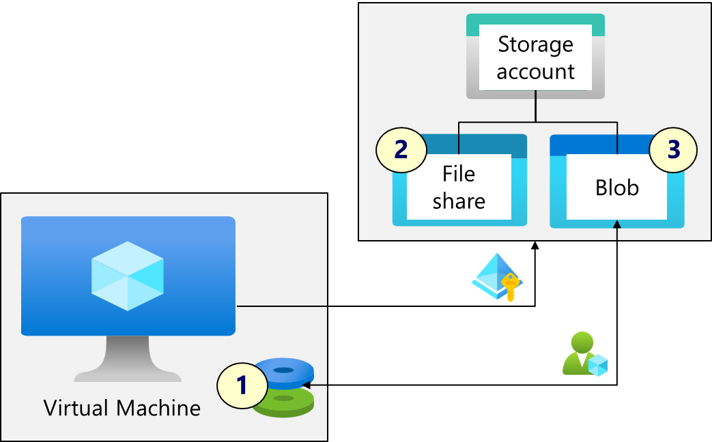

# Linux IaaS Infrastructure Project

## Project Overview
The goal of this project is to improve on the basics of deploying and administering linux virtual machines in the Azure Cloud.

The lab scenario is based on the **[Guided Project from Microsoft Learn](https://learn.microsoft.com/en-gb/training/modules/guided-project-deploy-administer-linux-virtual-machines-azure/),** but expands on these concepts for real world scenarios such as deploying with automation. 

In later parts of the project, we expand on this for governance and compliance requirements around the workload and also offload the automation to a CI/CD pipeline. 

### Project Scenario
As in the guided project, you have been asked to create a web server for a new ecommerce website. You want to explore how to create Linux virtual machines using Azure. Instead of doing the lab using the Azure Portal in a _ClickOps_ fashion, this project will focus on automating the build processes to:

- **Increase efficiency**
- **Increase conistency**
- **Reduce errors**

You are also interested in using SSH to securely connect to the virtual machine, so you can install the latest OS updates and the Nginx web server.

### Prerequisites

- A Linux environment, [WSL2 on Windows](https://learn.microsoft.com/en-us/windows/wsl/install) or [GitHub Codespace](https://marketplace.visualstudio.com/items?itemName=GitHub.codespaces#:~:text=GitHub%20Codespaces%20provides%20cloud-hosted%20development%20environments%20for%20any,Code%20or%20a%20browser-based%20editor%20that%27s%20accessible%20anywhere.)
- An Azure Subscription with Owner RBAC
- VS Code or Preferred IDE
- Terraform (configured with access to Azure Subscription with Environment Variables)
- Ansible
- Azure CLI
- Git

### Objectives for Part 1

In part 1, the infrastructure for the scenario is deployed locally from a workspace or local lab using a few CLI tools and commands.

We will implement the guided project in line with the requirements for part 1:

- Create an SSH key pair and set the required permissions
- Create an Ubuntu Linux Virtual Machine using Terraform
- Create an NSG and open up the ports for SSH and web traffic*
- Connect to the virtual machine using the SSH key
- Install the Nginx web service using a simple Ansible playbook

### **[Go to Part 1 >>](./infra/part1/Part1.md)**

### Objectives for Part 2

In part 2, your organization is migrating their virtual machine workloads to Azure. It is important that you are notified of any significant infrastructure changes. You plan to explore the capabilities of Azure Monitor, including alerts and Log Analytics.

We will implement the following objectives in Part 2
- Use Terraform to create the virtual machine, VM2
- Install the Nginx web service using Ansible.
- Configure a Data Collection Rule for Azure Monitoring
- Configure action groups and notifications.
- Create alerts.
- Trigger an alert by resizing the virtual machine.
- Configure an alert processing rule.

### **[Go to Part 2 >>](./infra/part2/Part2.md)**

### Objectives for Part 3

In part 3, you have been asked to explore how virtual machines can use Azure storage. You want to explore using Azure file shares and Blobs. You want to add and mount a data disk on the virtual machine. Lastly, you want to explore how to transfer data from Azure to the virtual machine with azcopy.

We include the requirements from the previous 2 parts but now also explore how to use the tools in this lab to automate the storage scenarios by implementing the following in Part 3

- Use **Terraform** to create the virtual machine and add a new _data disk_ - also create an Azure Storage Account with a Blob Container and a File Share  and set the **RBAC** roles
- Use **Ansible** to install and enable **Nginx**, configure the attached **data disk** and mount a connection to the **Azure File Share**
- Access the Azure File Share from the virtual machine.
- Copy a file from Azure Blob storage to the virtual machine data disk.

### **[Go to Part 3 >>](./infra/part3/Part3.md)**

### Objectives for Part 4

In part 4, you are asked to evaluate how to backup Azure virtual machines. Backup will protect the virtual machines from accidental or malicious data loss.

Instead of configuring backups in the Portal per virtual machine, you may be deploying many machines into a backend pool. 

The _Cloud Governance_ function want to make sure that all Production VMs are backed up **automatically** rather than relying on manual backup routines.

You also are asked to explore creating governance policies in separate modules to the workload. In this part you will:

- Use **Terraform** to create one or **more** virtual machines instances
- Deploy a **Terraform Module** for the backup requirements
- Deploy a **Recovery Services Vault** and a **Backup Policy** for the VMs
- Deploy an **Azure Policy Assignment** to deploy the backups for all VMs,**tagged** as _**'env : Production'**_

### **[Go to Part 4 >>](./infra/part4/Part4.md)**

### Objectives for Part 5

Part 5 offloads the deployment to a CI/CD pipeline using a sample GitHub actions yml workflow.

### **[Go to Part 5 >>](./infra/part5/Part5.md)**