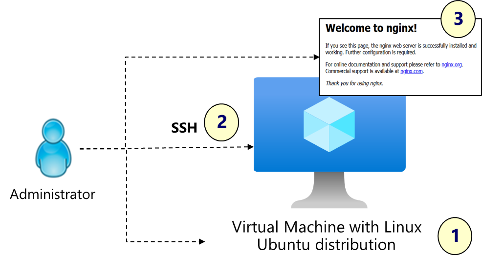

# Linux IaaS Infrastructure Project Plan

## 1. Project Overview
The goal of this project is to improve on the basics of deploying and administering linux virtual machines in the Azure Cloud. 

The lab scenario is based on the **[Guided Project from Microsoft Learn](https://learn.microsoft.com/en-gb/training/modules/guided-project-deploy-administer-linux-virtual-machines-azure/),** but expands on these concepts for real world scenarios.

### 1.1 Project Scenario
As in the guided project, you have been asked to create a web server for a new ecommerce website. You want to explore how to create Linux virtual machines using Azure. 

You are also interested in using SSH to securely connect to the virtual machine. You will want to install the latest OS updates and the Nginx web server.

**ADDITIONALLY** the service will....
the servier should...

### 1.2 Project Objectives
- Create an SSH key pair and set the required permissions
- Create a virtual machine using Terraform.
- Connect to the virtual machine and install OS updates.
- Install the Nginx web service and test to ensure it is working.
- Configure VM Insights.
- Configure action groups and notifications.
- Create alerts.
- Trigger an alert by resizing the virtual machine.
- Configure an alert processing rule.

### 1.3 Prerequisites

## 2. Project Steps
### 2.1 Create an SSH Key Pair for VM authentication
Create this key in your working directory. Terraform will read the public key content and configure it on the Azure Virtual Machine for SSH.
- Assign the ssh key a name for reference
- Create a key pair using ssh-Keygen
- Get its full path to inject into the terraform.tfvars file for the 'sshkeypath' variable

PS
```
#local variables
$tfvarsFilePath = ".\terraform.tfvars"
$variableName = "vmname"

#Get the 'vmname' variable from the .tfvars using an expression for matching key name
(Get-Content $tfvarsFilePath -Raw) -match "$variableName\s*=\s*`"(.+?)`"" | Out-Null
$localKey = ("$env:USERPROFILE\"+$Matches[1])

# Generate an SSH Key Pair using the name of the VM and store in your home folder (Optionally assign a passphrase for the key)
ssh-keygen -t rsa -b 4096 -C "thecite-linuxlab" -f $localKey

# Set the NTFS permissions using iCacls (Use chmod on Linux) to remove inherited permissions
icacls $localKey /reset 
icacls $localKey /grant:r "$($env:USERNAME):(F)"
icacls $localKey /inheritance:r
icacls $localKey

# Append some environment settings:

# 1. get subscription_id from environment vars, and append to .tfvars
"subscription_id = `"$Env:ARM_SUBSCRIPTION_ID`"" | Out-File $tfVarsFilePath -Encoding UTF8 -Append

# 2. get the public key path for terraform, and append to .tfvars
$tfPath = ([string]$localKey.Replace('\','/') + ".pub")
"sshkeypath = `"$tfPath`"" | Out-File $tfVarsFilePath -Encoding UTF8 -Append

# 3. get your Client IP address and add to .tvars for NSGs/ACLs
$labIP = ((Invoke-WebRequest -Uri "http://ifconfig.me/ip").Content.Trim() + "/32")
"my_ip_cidr = `"$labIP`"" | Out-File $tfVarsFilePath -Encoding UTF8 -Append
```


### 2.1 Deploy the Azure VM and its depandancies
Deploy the Virtual Machine and setup the SSH connection. A virtual network and NSG will be used to isolate inbund traffic from the internet. In real-world scenarios, inbound traffic would not usually be permitted directy to the web server, but more on that in a later lab exercise.



```
PS
$vm = (terraform output -raw vm_ip_address) ; ssh -i $key adminuser@$vm
```