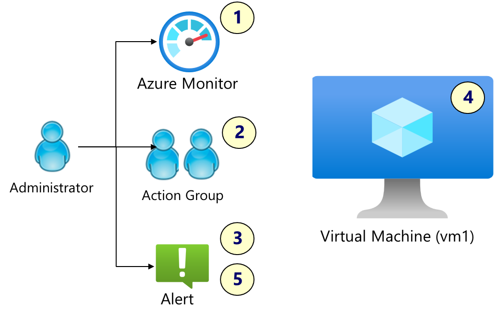

# Part 2

Part 2 is based on the Microsoft Learn guided project section **[Exercise 02: Monitor an Azure Linux virtual machine](https://microsoftlearning.github.io/Deploy-and-administer-Linux-virtual-machines-in-Azure/Instructions/Labs/Lab02-monitor-vms.html)**

### Architecture diagram



Please also remember to see the prerequisites in the **[README](../../README.md)** for this walkthrough before starting.

- Skill 1: Use Terraform to create the virtual machine, VM2
- Skill 2: Connect to the virtual machine using your SSH key.
- Skill 3: Install the Nginx web service using Ansible.
- Skill 4: Configure a Data Collection Rule for Azure Monitoring
- Skill 5: Configure action groups and notifications.
- Skill 6: Create alerts.
- Skill 7: Trigger an alert by resizing the virtual machine.
- Skill 8: Configure an alert processing rule.

**Note:** _While it is good practice to include monitoring capability in deployments, it's often better to monitor at scale using a baseline. We will explore monitoring baselines in a later part to see how you can then monitor your resources at scale but we will include it in the terraform configuration as per the lab scenario._

**_A note on the code snippets used in this walkthrough_**


```
# This code in a code block runs on your local to copy and paste.
```

> **adminuser@VM2:~$** These commands run on the Azure Virtual Machine in the SSH session

### 2.0 Set working folder
Step into your working folder and clone the repo is you do not have it locally. Ensure you are in the Part 2 working folder for this part.

```sh
git clone https://github.com/urbyone/linuxlab
cd ./infra/part2
```

### 2.1 Set local variables
These local variables will be passed to the terraform configuration. 

**Replace the email address** to where the alerts will be sent

```sh
emailaddress="youremail@domain.com"
```

```sh
region="eastus"
rsgname="RG2"
vmname="VM2"
vmSKU="Standard_DS1_v2"
client_ip=$(curl -s http://api.ipify.org)
my_ip_cidr="${client_ip}/32"
tfvarsFilePath=./terraform.tfvars
```

**Create a .tfvars file for the terraform workflow**


```sh
{
  echo "region = \"$region\""
  echo "rsgname = \"$rsgname\""
  echo "vmname = \"$vmname\""
  echo "vmSKU = \"$vmSKU\""
  echo "my_ip_cidr = \"$my_ip_cidr\""
  echo "email = \"$emailaddress\""
} > $tfvarsFilePath

```
### 2.2 Create an SSH Key Pair 

**Create the SSH Key Pair and set file permissions**


```sh
ssh-keygen -t rsa -b 4096 -f ~/.ssh/${vmname}_key -C ${rsgname}
chmod 600 ~/.ssh/${vmname}_key
```

### 2.3 Deploy the Azure VM and its dependencies
Deploy the Virtual Machine and setup the SSH connection. A virtual network and NSG will be used to isolate inbound traffic from the internet, allowing your client's IP address for **port 22**. 

**In real-world scenarios, inbound traffic would not usually be permitted directy to the web server, but more on that in later parts**

**It's Terraform Workflow Time!**

Check the **./terraform.tfvars** variables look correct once formatted by terraform


```sh
terraform fmt
cat ./terraform.tfvars
```

Now run the following **terraform workflow** to kick off the deployment.

```sh
terraform init
```

```sh
terraform validate
```
```sh
terraform plan
```
 Now run the apply, remembering to type **yes** if you do not use the **-auto-approve** flag
```sh
terraform apply
```

Wait for the deployment to complete successfully.
Then get some values from the **terrform outputs:**

```sh
vm=$(terraform output -raw vm_ip_address)
```
### 2.4 Verify a connection to the instance


```sh

ssh -i ~/.ssh/${vmname}_key adminuser@$vm
```
You will likely receive a **warning** about the host's fingerprint. Continue by typing **_yes_** to add the fingerprint to your known hosts file.

```sh
The authenticity of host 'xxx.xxx.xxx.xxx (xxx.xxx.xxx.xxx)' can't be established.
ED25519 key fingerprint is SHA256:+xxxxxxxxyyyyyyyzzzzzzzzz.
This key is not known by any other names.
Are you sure you want to continue connecting (yes/no/[fingerprint])? yes
```
Confirm you are connected to the vm, then logout:

>**_adminuser@VM2:~$_ logout**

### 2.5 Configure the Nginx server using Ansible

```sh
touch hosts
{
 echo "[web]"
 echo "$vm ansible_user=adminuser ansible_ssh_private_key_file=~/.ssh/${vmname}_key"
} > hosts

```
**Run the Ansible Playbook**
This playbook should:
- Install Nginx

```sh
ansible-playbook -i hosts ansible.yml
```
Wait for the ansible tasks to complete observing the results of the **PLAY RECAP** for any errors.

### 2.6 Check the web server is now up and running


```sh
curl $vm # Gets a response from the web server
echo $vm # Show the IP Address to paste into your browser
```
**You should now be able to visit the webpage of the nginx server from a web browser and have the following resources:**


### 2.7 Trigger an alert by resizing the virtual machine
You should have received an emall notifying you that you are in the Action Group "Cloud Ops" or similar, and maybe some initial alerts are waiting for you in Azure Monitor. 

By resizing the VM manually, the activity log will trigger new alerts. Resize the virtual machine follwoing the below commands.

```sh
# Step 1: Deallocate the VM
az vm deallocate --resource-group $rsgname --name $vmname
```
```sh
# Step 2: Update the VM size
az vm resize --resource-group $rsgname --name $vmname --size Standard_DS2_v2
```
```sh
# Step 3: Verify the size Changes
az vm list --query "[].hardwareProfile.vmSize" --output tsv
```
```sh
# Step 4: Start the VM
az vm start --resource-group $rsgname --name $vmname
```
### 2.8 Check Azure Monitor Alerts

Now check Azure Monitor and your email inbox for alerts triggered and explore the Activity Logs on the Virtual Machine.


### 2.9 Restore the VM size configuration using terraform (Optional)

You have just resized the VM manually in the previous step which now no longer matches your original configuration files. This is sometimes known as a configuration drift. Use the terraform workflow to repair the config back to your original state.

```sh
terraform plan
```
Terraform  will identify the change and attempt to update the VM size back to the original size

```sh
terraform apply -auto-approve
```
```sh
az vm list --query "[].hardwareProfile.vmSize" --output tsv
```
The VM should have resized from Standard_DS2_v2 to
>Standard_DS1_v2

## Part 2 Cleanup
Once you have finished, **remember to save costs by destroying the infrastruture**


```sh
rm hosts
terraform destroy -auto-approve
```