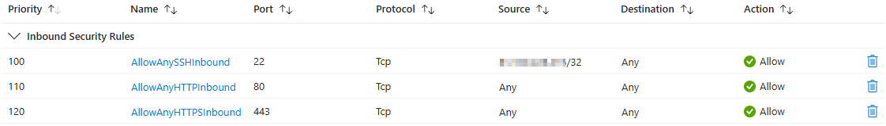
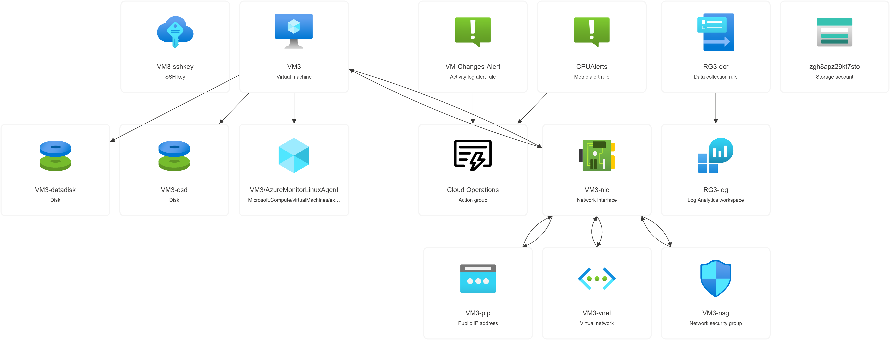

# Part 3

Part 3 is based on the Microsoft Learn guided project section **[Exercise 03: Access storage for an Azure Linux virtual machine](https://microsoftlearning.github.io/Deploy-and-administer-Linux-virtual-machines-in-Azure/Instructions/Labs/Lab03-storage-vms.html)**

### Architecture diagram


Please also remember to see the prerequisites in the **[README](../../README.md)** for this walkthrough before starting.

- Skill 1: Use **Terraform** to create the virtual machine and add a new _data disk_ - also create an Azure Storage Account with a Blob Container and a File Share  and set the **RBAC** roles
- Skill 2: Connect to the virtual machine using your SSH key.
- Skill 3: Use **Ansible** to install and enable **Nginx**, configure the attached **data disk** and mount a connection to the **Azure File Share**
- Skill 4: Access the Azure File Share from the virtual machine.
- Skill 5: Copy a file from Azure Blob storage to the virtual machine data disk.


**_A note on the code snippets used in this walkthrough_**


```
# This code in a code block runs on your local to copy and paste.
```

> **adminuser@VM3:~$** These commands run on the Azure Virtual Machine in the SSH session

### 3.0 Set working folder
Step into your working folder and clone the repo is you do not have it locally. Ensure you are in the Part 3 working folder for this part.

```sh
git clone https://github.com/urbyone/linuxlab
cd ./infra/part3
```
### 3.1 Log into Azure CLI
Ensure you have installed **Azure CLI** for this step. Your objectid will be used to set **EntraID RBAC Roles** for the storage account deployed.

**Az** will also be used for some Azure Storage file operations


```sh
azcli --version
```
If not installed, run the below on your local if not installed.
```sh
sudo apt update && sudo apt upgrade
sudo snap install azcli
```
Login to your **az** account you are using for this exercise:
```sh
az login --tenant $ARM_TENANT_ID
```
### 3.2 Set local variables
These local variables will be passed to the terraform configuration. 

**Replace the email address** to where the alerts will be sent

```sh
emailaddress="youremail@domain.com"
```

```sh
objectid="$(az ad signed-in-user show --query id)" # gets userID for your account logged into az cli
region="eastus"
rsgname="RG3"
vmname="VM3"
vmSKU="Standard_DS1_v2"
client_ip=$(curl -s http://api.ipify.org)
my_ip_cidr="${client_ip}/32"
tfvarsFilePath=./terraform.tfvars
```

**Create a .tfvars file for the terraform workflow**


```sh
{
  echo "userid = $objectid"
  echo "region = \"$region\""
  echo "rsgname = \"$rsgname\""
  echo "vmname = \"$vmname\""
  echo "vmSKU = \"$vmSKU\""
  echo "my_ip_cidr = \"$my_ip_cidr\""
  echo "email = \"$emailaddress\""
} > $tfvarsFilePath

```
### 3.3 Create an SSH Key Pair 

**Create the SSH Key Pair and set file permissions**


```sh
ssh-keygen -t rsa -b 4096 -f ~/.ssh/${vmname}_key -C ${rsgname}
chmod 600 ~/.ssh/${vmname}_key
```

### 3.4 Deploy the Azure VM and its dependencies
Deploy the Virtual Machine and setup the SSH connection. A virtual network and NSG will be used to isolate inbound traffic from the internet, allowing your client's IP address for **port 22**. 



**In real-world scenarios, inbound traffic would not usually be permitted directy to the web server, but more on that in later parts**

**It's Terraform Workflow Time!**

Check the **./terraform.tfvars** variables look correct once formatted by terraform


```sh
terraform fmt
cat ./terraform.tfvars
```

Now run the following **terraform workflow** to kick off the deployment.

```sh
terraform init
```

```sh
terraform validate
```
```sh
terraform plan
```
 The plan should indicate 30 resources to be deployed to your **Resource Group**
 _**Plan: 30 to add, 0 to change, 0 to destroy**_

 Now run the apply, remembering to type **yes** if you do not use the **-auto-approve** flag
```sh
terraform apply
```
Wait for the deployment to complete successfully:

_**Apply complete! Resources: 30 added, 0 changed, 0 destroyed.**_

Then we will retrieve some values from the **terraform outputs** that we will need to connect the server to the **Azure Storage** account

```sh
vm=$(terraform output -raw vm_ip_address)
storageaccount=$(terraform output -raw storageaccount)
sharename=$(terraform output -raw sharename)
containername=$(terraform output -raw containername)
```
Get the **storage account key** which we will need to create a SAS token later.
```sh
key=$(az storage account keys list --resource-group $rsgname --account-name $storageaccount --query '[0].value' --output tsv)
```

### 3.5 Verify a connection to the instance

```sh
ssh -i ~/.ssh/${vmname}_key adminuser@$vm
```
You will likely receive a **warning** about the host's fingerprint. Continue by typing **_yes_** to add the fingerprint to your known hosts file.

```sh
The authenticity of host 'xxx.xxx.xxx.xxx (xxx.xxx.xxx.xxx)' can't be established.
ED25519 key fingerprint is SHA256:+xxxxxxxxyyyyyyyzzzzzzzzz.
This key is not known by any other names.
Are you sure you want to continue connecting (yes/no/[fingerprint])? yes
```
Confirm you are connected to the vm, then logout:

>**_adminuser@VM3:~$_ logout**

### 3.6 Configure the Nginx server, Data Disk and mount the Azure File share, using Ansible

Review the updated **ansible.yml** to see it now includes a task to copy the setupscript.sh and the connectionscript.sh to the remote host and run the configs.

```sh
cat ansible.yml
```


```sh
touch hosts
{
 echo "[web]"
 echo "$vm ansible_user=adminuser ansible_ssh_private_key_file=~/.ssh/${vmname}_key"
} > hosts

```
First we will copy the script template from the repo to a new **connectionscript.sh** with the new details of the storage account and share that were created. 

For this we will use the **sed** command to perform an in-place upgrade of the storage account details before running **Ansible**

### 3.6.1 Copy the template connection script to a bash script
```sh
cp connectionscript.txt connectionscript.sh # The .sh file will be added to .gitignore so credentials are not in the version control
```
### 3.6.2 Replace the details in the new bash script
```sh
sed -i "s/insertstorageaccountnamehere/${storageaccount}/g" ./connectionscript.sh && sed -i "s/insertsharenamehere/${sharename}/g" ./connectionscript.sh 
```

```sh
key_trim=$(echo $key | tr -d '\r')
sed -i "s|"insertstoragekeyhere"|${key_trim}|g" connectionscript.sh
```


**Run the Ansible Playbook**

This playbook should:

- **Install Nginx**
- **Install cifs-utils**
- **Configure the new data disk**
- **Configure the VM to mount to the Azure File Share**
- **Install AZCOPY utility for copying blobs**


```sh
ansible-playbook -i hosts ansible.yml
```
Wait for the ansible tasks to complete observing the results of the **PLAY RECAP** for any errors. The results should similar to this:

**_ok=10   changed=7    unreachable=0    failed=0    skipped=0    rescued=0    ignored=0_**

### 3.7 Check the web server is now up and running


```sh
curl $vm # Gets a response from the web server
echo $vm # Show the IP Address to paste into your browser
```

**_Welcome to nginx!_**
_If you see this page, the nginx web server is successfully installed and working. Further configuration is required._

_For online documentation and support please refer to nginx.org.
Commercial support is available at nginx.com._

_Thank you for using nginx._

**You should now be able to visit the webpage of the nginx server from a web browser and have the following resources:**



### 3.7.1 Check the web server now also has the data drive configured

Run **lsblk** over ssh to ensure the datadrive has been partitioned
```sh
ssh -i ~/.ssh/${vmname}_key adminuser@$vm lsblk -P | grep 'NAME="sdc1"'
```
Should return something similar to:
>**NAME="sdc1"** MAJ:MIN="8:33" RM="0" **SIZE="4G"** RO="0" TYPE="part" MOUNTPOINTS=**"/datadrive"**

### 3.7.2 Check that /mnt/share1 on the VM is mounted to Azure Files
The Azure File Share should have been mounted
```sh
ssh -i ~/.ssh/${vmname}_key adminuser@$vm ls /mnt | grep 'share1'
```
>**share1**

### 3.7.3 Copy the example 'filedoc.txt' to the Azure Files share
In this step you will copy a file to the Azure Storage fileshare using AzCli and a temporary SAS token

Create a new SAS token with a **60 minute expiry** for Azure Files
```sh
end=`date -u -d "60 minutes" '+%Y-%m-%dT%H:%MZ'`
sas=`az storage share generate-sas -n $sharename --account-name $storageaccount --https-only --permissions dlrw --expiry $end -o tsv`
```
Upload the **filedoc.txt** in the files folder to the new file share
```sh 
az storage file upload -s $sharename --account-name $storageaccount --source ../../files/filedoc.txt  --sas-token $sas
```

### 3.7.4 Verify you can now view the uploaded file on the VM
```sh
ssh -i ~/.ssh/${vmname}_key adminuser@$vm ls -l /mnt/${sharename}
```
You should now be able to Create/Read/Write/Delete any file on the Azure File Share since the VM has an RBAC role on the storage account.
```sh
filename="filedoc.txt"
ssh -i ~/.ssh/${vmname}_key adminuser@$vm cat /mnt/${sharename}/${filename}
```
### 3.8 Copy a file to the Azure Blob container

Upload the **../files/blobimage.png** to the container
```sh
az storage blob upload --account-name $storageaccount --container-name $containername --name blobimage.png --file ../../files/blobimage.png
```
### 3.8.1 Retrieve the URL for the blob in the Azure Container
For convenience, copy the URL.

```sh
# Get the URL
urlblob=$(az storage blob url --account-name $storageaccount --container-name $containername --name blobimage.png --output tsv)
echo $urlblob # Blob URL to copy/paste into the server
```

### 3.8.2 Login to the VM
```sh
ssh -i ~/.ssh/${vmname}_key adminuser@$vm
```
Note the **Azure Managed Disk** on **/datadrive** should be empty:
>**adminuser@VM3~$ ls -l /datadrive**

>total 0

### 3.8.3 Copy Blob file from the Storage Account to the VM Data Disk
Now login to **AZCOPY** (deployed via Ansible earlier) using the **VM's managed identity** preconfigured by Terraform, and copy the blob from the container to the /datadrive disk. 

>**adminuser@VM3~$  sudo /opt/azcopy/azcopy login --identity**

>INFO: Login with identity succeeded.

>**adminuser@VM3~$  sudo /opt/azcopy/azcopy copy _urlblob_ /datadrive**

Number of File Transfers: 1
Number of Folder Property Transfers: 0
Number of Symlink Transfers: 0
Total Number of Transfers: 1
Number of File Transfers Completed: 1
Number of Folder Transfers Completed: 0
Number of File Transfers Failed: 0
Number of Folder Transfers Failed: 0
Number of File Transfers Skipped: 0
Number of Folder Transfers Skipped: 0
Total Number of Bytes Transferred: 52437
Final Job Status: Completed

>**adminuser@VM3~$  ls -l /datadrive**

The blob should now have been downloaded to the disk on **/datadrive** and you can logoff to complete the lab.

>**adminuser@VM3~$ logout**

## Part 3 Cleanup
Once you have finished, **remember to save costs by destroying the infrastruture**


```sh
terraform destroy -auto-approve
rm hosts connectionscript.sh
```