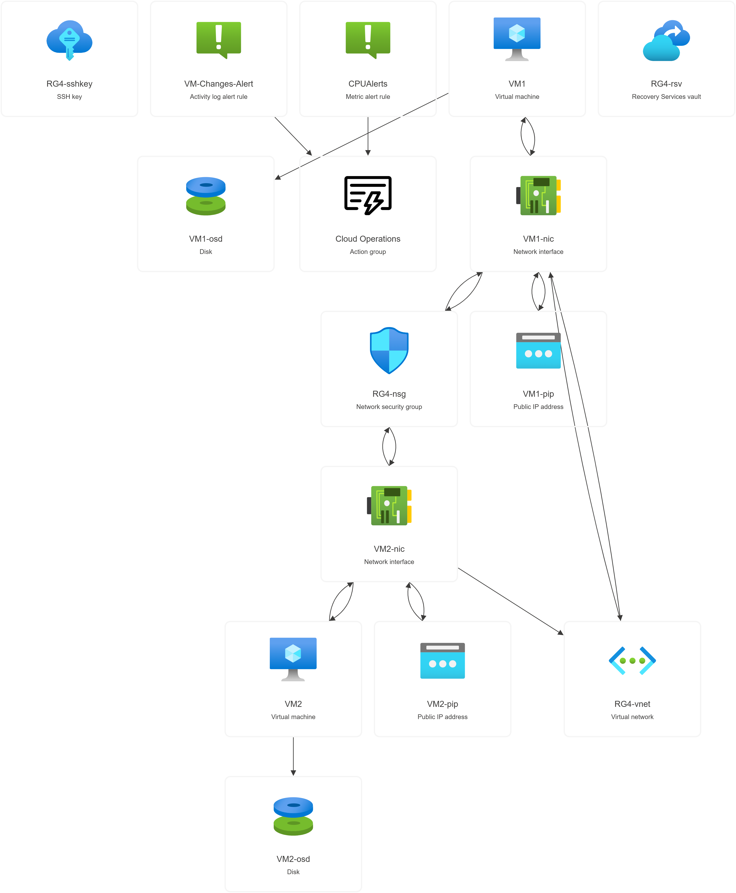
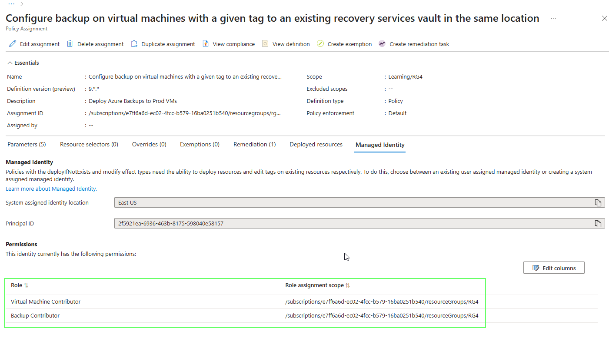

# Part 4

Part 4 is based on the Microsoft Learn guided project section **[Exercise 04: Back up Azure Linux virtual machines](https://microsoftlearning.github.io/Deploy-and-administer-Linux-virtual-machines-in-Azure/Instructions/Labs/Lab04-backup-vms.html)**

### Architecture diagram


Please also remember to see the prerequisites in the **[README](../../README.md)** for this walkthrough before starting.

- Skill 1: Use **Terraform** to create one or **more** virtual machines instances
- Skill 2: Create a **Terraform Module** for the backup requirements
- Skill 3: Deploy a **Recovery Services Vault** and a **Backup Policy** for the VMs
- Skill 4: Deploy an **Azure Policy Assignment** to deploy the Backups for all VMs,**tagged** as _'Production'_


**_A note on the code snippets used in this walkthrough_**


```
# This code in a code block runs on your local to copy and paste.
```

### 4.0 Set working folder
Step into your working folder and clone the repo is you do not have it locally. Ensure you are in the Part 3 working folder for this part.

```sh
git clone https://github.com/urbyone/linuxlab
cd ./infra/part4
```
### 4.1 Set local variables
These local variables will be passed to the terraform configuration. 

**Replace the email address** to where the alerts will be sent

```sh
emailaddress="youremail@domain.com"
```

```sh
region="eastus"
rsgname="RG4"
vmname="VM" # VM Prefix
vmSKU="Standard_DS1_v2"
client_ip=$(curl -s http://api.ipify.org)
my_ip_cidr="${client_ip}/32"
tfvarsFilePath=./terraform.tfvars
```

**Create a .tfvars file for the terraform workflow**


```sh
{
  echo "region = \"$region\""
  echo "rsgname = \"$rsgname\""
  echo "vmname = \"$vmname\""
  echo "vmSKU = \"$vmSKU\""
  echo "my_ip_cidr = \"$my_ip_cidr\""
  echo "email = \"$emailaddress\""
} > $tfvarsFilePath
```

### 4.2 Deploy the Azure VM(s) and its dependencies
Deploy the Virtual Machines 

**It's Terraform Workflow Time!**

Check the **./terraform.tfvars** variables look correct once formatted by terraform


```sh
terraform fmt
cat ./terraform.tfvars
```

Now run the following **terraform workflow** to kick off the deployment.

**NOTE:** 

**This deployment will require a number of instance to be defined.** 

```sh
terraform init
```

```sh
terraform validate
```
```sh
terraform plan
```
Ensure your plan contains a supported VM image for Auto Backup. See [here](https://learn.microsoft.com/en-gb/azure/backup/backup-azure-policy-supported-skus) for more information

**You can deploy one or more instances of the VM and the Terraform configuration will increment accordingly.**

**_Please ensure you clean up unused resources at the end of the lab!_**

```
var.instances
  *** WARNING - DEPLOYING MORE INSTANCES WILL LEAD TO HIGHER COSTS! Ensure you are in control of your subscription costs and know how to destroy resources before proceeding! ***

  Enter a value:
```
 The plan should indicate enough resources based on the number of instances you have requested.

 Now run the apply, remembering to type **yes** if you do not use the **-auto-approve** flag
```sh
terraform apply
```
Wait for the deployment to complete successfully.
The resource group should have a similar deployment to the below depending on the number of **instances** you deployed.




Check how many VMs you have deployed

```sh
az vm list --resource-group $rsgname --query [].name -o tsv
```
### 4.3 Review the Azure Policy
Note there will now be an **Azure Policy** assigned on the Resource Group scope which will enforce backups on any newly created Virtual Machines. 

You can also remedidate any non-compliant machines that were deployed before the policy took effect. The policy assignment requires a managed identity and some RBAC roles.


You can view the policy paramaters set by the deploymemt.


## Part 4 Cleanup
Once you have finished, **remember to save costs by destroying the infrastruture**


```sh
terraform destroy -auto-approve
```