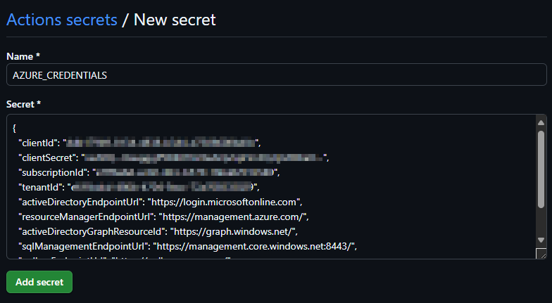
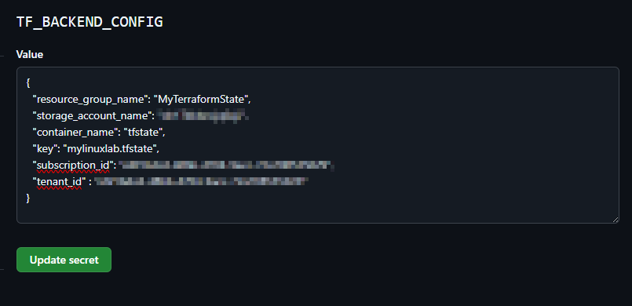

# Part 5 - Terraform, Ansible, GitHub CI/CD

Part 5 of this project is to put all the previous parts together into a **CI/CD pipeline.**

The aim here is to make changes to the infrastructure code, push to your repository and have a simple **GitHub Actions** workflow implement the changes automatically.

The previous parts were all based on the administration of Linux virtual machines following the scenario based guidance from the Microsoft Learn **[Linux VM Guided Project](https://learn.microsoft.com/en-gb/training/modules/guided-project-deploy-administer-linux-virtual-machines-azure/)** 

In this part we automate the deployment using a pipeline using [GitHub Actions](https://docs.github.com/en/actions/about-github-actions/understanding-github-actions)

**Terraform will deploy the infrastructure to Azure**

**Ansible will SSH to the VM(s) and configure the deployed infrastructure as per the specifications in the previous labs**

# Pipeline Diagram


### Components

For this you will need the following if not already available:

- A GitHub Account and a private repository created
- Azure CLI Installed and configured
- An Azure Subscription with Owner RBAC activated
- Service Principal for GitHub access
- An Azure Storage Account and Container (This is to store the Terraform state file)

# Prerequisites
**NOTE:** You can skip the below steps if you already have them configured

#### Clone this GitHub Repo as a Quick Start

```sh
git clone https://github.com/urbyone/linuxlab
cd linuxlab
```

#### Create a New Private Repo in GitHub

Go to GitHub.com and create a new private repository under your account or organization.

_Don't initialize the repository with a README, .gitignore, or license file_ as we will be pushing the cloned files back up.

```sh
git remote set-url origin https://github.com/YOUR_USERNAME/NEW_PRIVATE_REPOSITORY
git remote -v
```


#### Login to **Azure CLI**
Ensure you have selected a valid **subscription** for this exercise and have **Owner** permissions active to assign RBAC roles

```sh
az login
```

#### Check Az Environment variables
```sh
env | grep "ARM_SUBSCRIPTION_ID"
```
If this is not listed, create a **subscriptionId** variable from your az context.

```sh
ARM_SUBSCRIPTION_ID=$(az account show --query id -o tsv)
ARM_TENANT_ID=$(az account show --query tenantId -o tsv)
```
#### Configure Azure Storage for the Terraform remote state
Create a resource group for the storage account if not already configured.
```sh
region="uksouth"
mytfRSG="MyTerraformState"
az group create -n $mytfRSG -l $region --tags Description="Terraform State File" Service="GitHub Actions Linux Labs" URL="https://github.com/urbyone/linuxlab"
```

##### Create an Azure Blob Container for state files
###### Generate a random azure storage account name (change if needed as accounts need to be unique)

```sh
accountName=$(head /dev/urandom | tr -dc a-z0-9 | head -c 15)
echo $accountName
```

```sh
az storage account create --resource-group $mytfRSG --name $accountName --sku Standard_LRS --encryption-services blob
az storage container create --name "tfstate" --account-name $accountName
```

#### Create an Azure Service Principal
This SP will be used for **Github CI/CD Deployments via Actions**
```sh
appName="myTestGitHubActions"
az ad sp create-for-rbac --name $appName --role reader --scopes /subscriptions/${ARM_SUBSCRIPTION_ID} --json-auth
```

**Copy the output from the above step this will be for the GitHub Azure Credentials.**
>{
  "clientId": "xxxxxxxx-xxxx-xxxx-xxxx-xxxxxxxxxxxx",
  "clientSecret": "xxxxxxxxxxxxxxxxxxxxxxxxxxxxxxxxxxxxxx",
  "subscriptionId": "xxxxxxxx-xxxx-xxxx-xxxx-xxxxxxxxxxxx",
  "tenantId": "xxxxxxxx-xxxx-xxxx-xxxx-xxxxxxxxxxxx",
  "activeDirectoryEndpointUrl": "https://login.microsoftonline.com",
  "resourceManagerEndpointUrl": "https://management.azure.com/",
  "activeDirectoryGraphResourceId": "https://graph.windows.net/",
  "sqlManagementEndpointUrl": "https://management.core.windows.net:8443/",
  "galleryEndpointUrl": "https://gallery.azure.com/",
  "managementEndpointUrl": "https://management.core.windows.net/"
}


#### Grant the Service Principal access to your Subscription
Use the **appID** of the principal created above to create the identity

```sh
az role assignment create --assignee <appID> --role Contributor --scope /subscriptions/${ARM_SUBSCRIPTION_ID}
```

### Create GitHub Secrets
From your Github repo, create the following secrets


#### Secret 1 : Azure Credentials
Take the service principal details you created above and paste the json into a secret called **"AZURE_CREDENTIALS"** in GitHub Actions. This will be the service principal to run the deployment.

https://github.com/yourusername/yourreponame/settings/secrets/actions




#### Secret 2: SSH Public Key
Generate an SSH key pair. 
Store the public key as a secret for you to use in Terraform to assign to the VM(s) adminuser as part of the Terraform process

```sh
ssh-keygen -t rsa -b 4096 -f ~/.ssh/mysshkey -C "githubactions"
ssh_public_key=$(cat ~/.ssh/mysshkey.pub)
echo $ssh_public_key
```
Create a secret called **"SSH_PUBLIC_KEY"** in Github Actions with the **public key** contents


#### Secret 3: SSH Private Key
Create a secret called **"SSH_PRIVATE_KEY"** in Github Actions with the **private key** contents. 
This will be for the **Ansible** SSH connection after the deployment.

Always **protect** your private keys.

```sh
ssh_private_key=$(cat ~/.ssh/mysshkey)
echo $ssh_private_key
```


#### Secret 4: Terraform backend details
Create a secret called **"TF_BACKEND_CONFIG"** to contain your backend settings for the Terraform remote state file.

You will need to replace the details with your resource group, storage account, tenant and subsctiption information. 

Save this as json format like below and the backend configuration will be pulled by the pipeline.

```
{
  "resource_group_name": "your-resource-group",
  "storage_account_name": "your-storage-account-name",
  "container_name": "your-container-name",
  "key": "your-blob-name.tfstate",
  "subscription_id": "your-subscription-id",
  "tenant_id": "your-tenant-id"
}
```



You should now have **four** secrets stored to use in future deployments.

- **AZURE_CREDENTIALS**
- **SSH_PUBLIC_KEY**
- **SSH_PRIVATE_KEY**
- **TF_BACKEND_CONFIG**


# Deployment


**Update and save your [variables.tf](./variables.tf)** in order to trigger the deployment.

Update the variables.tf before commiting, specifically you can update your Email Address, VM name, resouce group name and other preferred deployment options in the variables.tf.

Once your environment is setup, pushing your code to your Github repo will start the pipeline due to the trigger on the **pipeline.yml.**


```sh
git add .
git commit -m "DeployMyLinuxLab"
git push -u origin main

```
The pipeline will:
- **Checkout your repo**
- **Login to Azure using the Service Principal secret**
- **Install Terraform**
- **Get the SSH key pair for use in the deployments**
- **Create a backend.tf file using the TF_BACKEND_CONFIG secret**
- **Run the Terraform workflows using the backend remote state**
- **Create a VM shel script to configure the data disk and file share**
- **Create an Ansible hosts/inventory file**
- **Deploy the ansible.yml file to configure the deployed servers in the inventory file**

Check your Deployment was successful in Github Actions and you should be able to see your infrastructure configuration in the resource group you specified


# Cleanup

**Remember to clean up your resources!**
From the infra/part5 we have been working in, you can initialise Terraform and destroy the project

```sh
terraform init
terraform destroy -var="ssh_key=${ssh_key}" -auto-approve
```