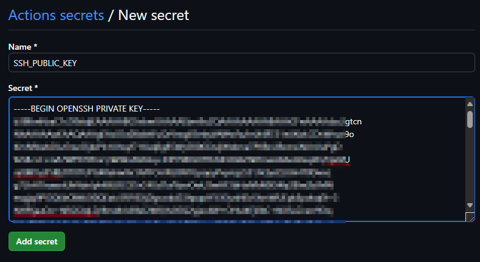

# Part 5

Part 5 of this project is to put all the previous parts together into a **CI/CD pipeline.**

The aim here is to make changes to the infrastructure code, push to your repository and have a GitHub Actions workflow implement the changes automatically.


The previous parts were all based on the administration of Linux virtual machines following the scenario based guidance from the Microsoft Learn **[Linux VM Guided Project](https://learn.microsoft.com/en-gb/training/modules/guided-project-deploy-administer-linux-virtual-machines-azure/)** 

In this part we automate the deployment using a pipeline using [GitHub Actions](https://docs.github.com/en/actions/about-github-actions/understanding-github-actions)
### Components

For this you will need the following if not already available:

- A GitHub Account and a Private Repository
- Azure CLI Installed and configured
- Azure Subscription
- Service Principal for RBAC
- An Azure Storage Account and Container (This is to store the Terraform state file)

# Prerequisites
**NOTE:** You can skip the below steps if you already have them configured

#### Clone this GitHub Repo as a Quick Start

```sh
git clone https://github.com/urbyone/linuxlab
cd linuxlab
```

#### Create a New Private Repo in GitHub
Create a New **Private Repository**

Go to GitHub.com and create a new private repository under your account or organization.

_Don't initialize the repository with a README, .gitignore, or license file_ as we will be pushing the cloned files back up.

```sh
git remote set-url origin https://github.com/YOUR_USERNAME/NEW_PRIVATE_REPOSITORY
git remote -v
```


#### Login to **Azure CLI**
Ensure you have selected a valid **subscription** for this exercise and have **Owner** permissions active to assign RBAC roles

```sh
az login
```

#### Check Az Environment variables
```sh
env | grep "ARM_SUBSCRIPTION_ID"
```
If this is not listed, create a **subscriptionId** variable from your az context.

```sh
ARM_SUBSCRIPTION_ID=$(az account show --query id -o tsv)
ARM_TENANT_ID=$(az account show --query tenantId -o tsv)
```

#### Create an Azure Service Principal
This SP will be used for **Github CI/CD Deployments via Actions**
```sh
appName="myTestGitHubActions"
az ad sp create-for-rbac --name $appName --role reader --scopes /subscriptions/${ARM_SUBSCRIPTION_ID} --json-auth
```

**Copy the output from Azure needed below which will be needed for GitHub Secrets.**
>{
  "clientId": "xxxxxxxx-xxxx-xxxx-xxxx-d7388608bd0c",
  "clientSecret": "xxxxxxxxxxxxxxxxxxxxxxxxxxxxxxxxxxxxxx",
  "subscriptionId": "xxxxxxxx-xxxx-xxxx-xxxx-xxxxxxxxxxxx",
  "tenantId": "xxxxxxxx-xxxx-xxxx-xxxx-xxxxxxxxxxxx",
  "activeDirectoryEndpointUrl": "https://login.microsoftonline.com",
  "resourceManagerEndpointUrl": "https://management.azure.com/",
  "activeDirectoryGraphResourceId": "https://graph.windows.net/",
  "sqlManagementEndpointUrl": "https://management.core.windows.net:8443/",
  "galleryEndpointUrl": "https://gallery.azure.com/",
  "managementEndpointUrl": "https://management.core.windows.net/"
}


#### Grant the Service Principal access to your Subscription
Use the **appID** of the principal created above to create the identity

```sh
az role assignment create --assignee <appID> --role Contributor --scope /subscriptions/${ARM_SUBSCRIPTION_ID}
```

#### Create your GitHub Actions Secrets
From your Github repo, create the following secrets


##### Secret 1 : Azure Credentials
Take the appID details you created above and paste the json into a secret called **AZURE_CREDENTIALS** in GitHub Actions. This will be the service principal created earlier to run the deployments

https://github.com/yourusername/yourreponame/settings/secrets/actions


##### Secret 2: SSH Public Key
Generate a key so the public key can be stored as a secret for you to use in Terraform to assign to the VM(s)

```sh
ssh-keygen -t rsa -b 4096 -f ~/.ssh/mysshkey -C "githubactions"
ssh_key=$(cat ~/.ssh/mysshkey.pub)
echo $ssh_key
```
Create a secret called SSH_KEY in Github Actions with the **public key** contents



You should now have 2 secrets stored to use in future deployments.


#### Resource Group for the Terraform remote state file
Create a resource group for the storage account if not already configured.
```sh
region="uksouth"
mytfRSG="MyTerraformState"
az group create -n $mytfRSG -l $region --tags Description="Terraform State File" Service="GitHub Actions Linux Labs" URL="https://github.com/urbyone/linuxlab"
```

##### Create an Azure Blob Container for Terraform State file
###### Generate a random azure storage account name (change if needed as accounts need to be unique)

```sh
accountName=$(head /dev/urandom | tr -dc a-z0-9 | head -c 15)
echo $accountName
```

```sh
az storage account create --resource-group $mytfRSG --name $accountName --sku Standard_LRS --encryption-services blob
az storage container create --name "tfstate" --account-name $accountName
```


#### Prepare the Terraform Configuration
**CD to the infra/part5** working folder with the terraform configuration files


**Update and save the [backend.tf](./backend.tf) with your own values.**

>terraform {
  backend "azurerm" {
    resource_group_name  = "MyTerraformState"
    storage_account_name = **"your_storage_account_name"**
    container_name       = "tfstate"
    key                  = "terraform.tfstate"
    tenant_id            = **"your_tenant_id"**
    subscription_id      = **"your_subscription_id"**
  }
}

**NOTE: Storing this information in your private repo might be ok for lab scenarios but be midful of sharing sensitive information / IDs in version control since usually this would not be recommended in production scenarios.**

**Update and save your [variables.tf](./variables.tf)**
Speciically make sure to update your IP address, Email Address, preferred deployment options


# Pipeline Deployment
Once your environment is setup, pushing your Terraform code to your Github repo will start the pipeline.


```sh
git add .
git commit -m "DeployMyCode"
git push -u origin main

```

Check your Deployment was successful in Github Actions an dyou should be able to see your infrastructure coniguration in the resource group you specified


# Cleanup

**Remember to clean up your resources!**
From the infra/part5 we have been working in, you can initialise Terraform and destroy the project

```sh
terraform init
terraform destroy -var="ssh_key=${ssh_key}" -auto-approve
```